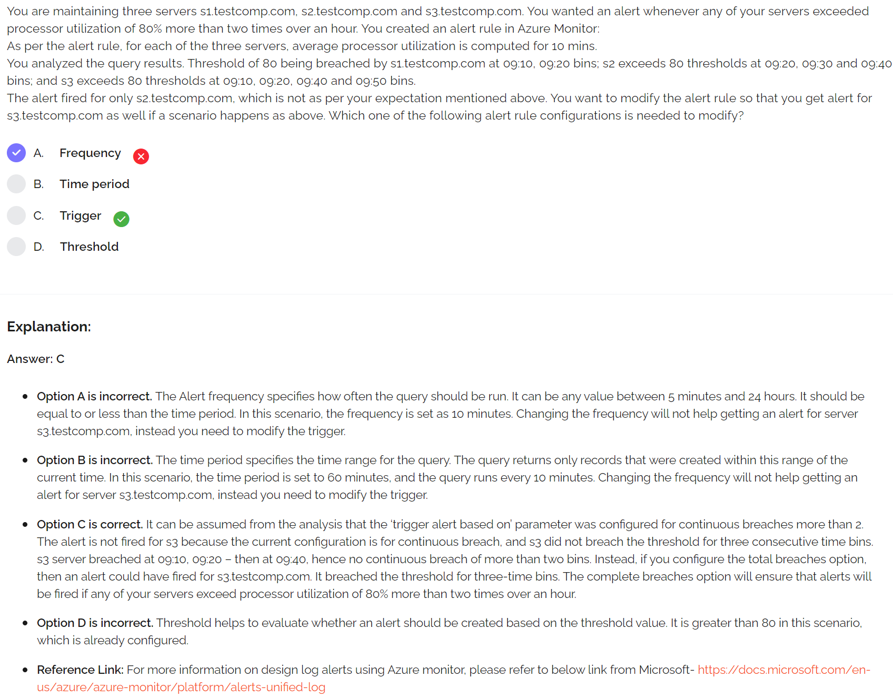
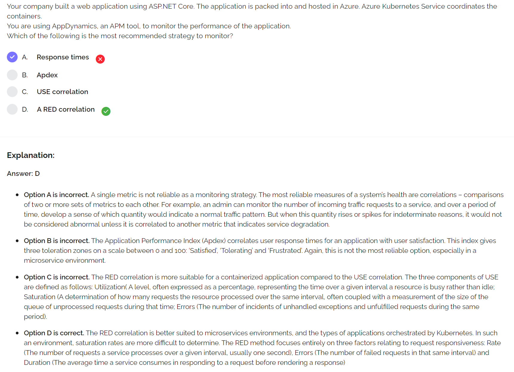

https://docs.microsoft.com/en-us/learn/modules/cmu-monitor-cloud-resources/3-metrics-indicators-correlations
- `RED` = Rate, Errors, Duration... **use for containers**
- `ApDex` = User satisfaction
- `USE` = Utilization, Saturation, Errors
