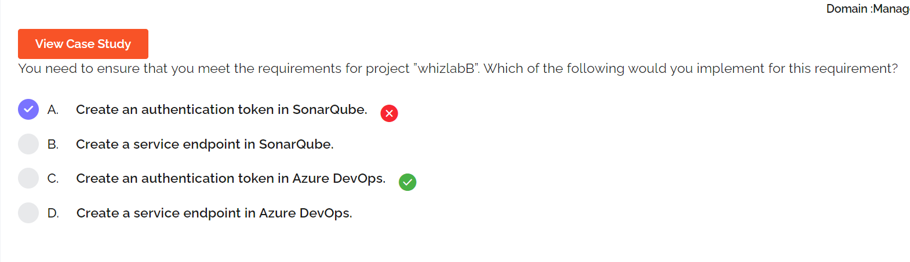
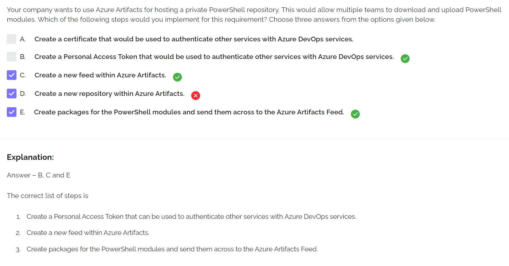

### Another test...

Azure Automation
1. upload
2. compile
3. onboard
4. assign
5. check

App Insights
- `Funnel`: The progression through a series of steps in a web application is known as a funnel
- `Cohort`: A cohort is a set of users, sessions, events, or operations that have something in common
- `Impact`: Impact analyzes how load times and other properties influence conversion rates for various parts of your app
- `Retention`: The retention feature in Azure Application Insights helps you analyze how many users return to your app, and how often they perform particular tasks or achieve goals
- `User Flows`: The User Flows tool visualizes how users navigate between the pages and features of your site

