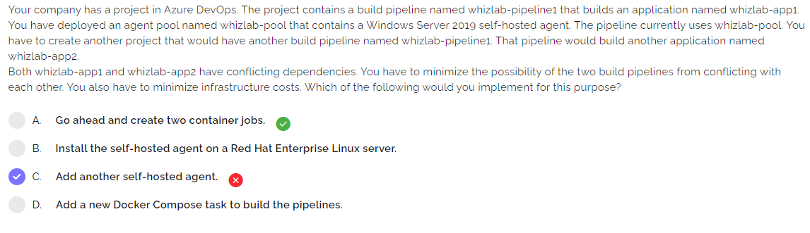
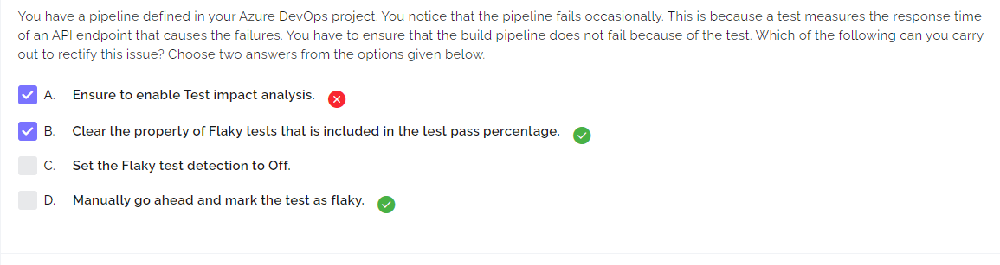
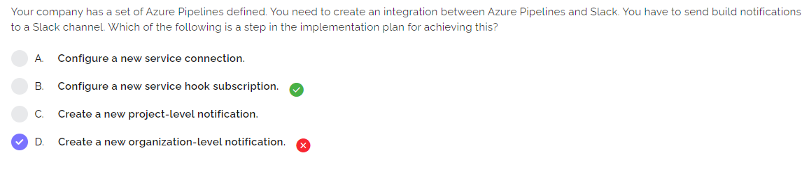
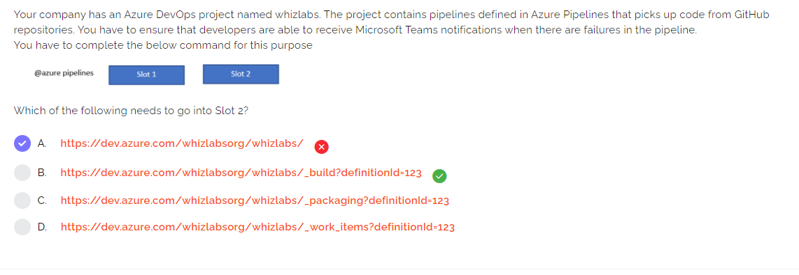

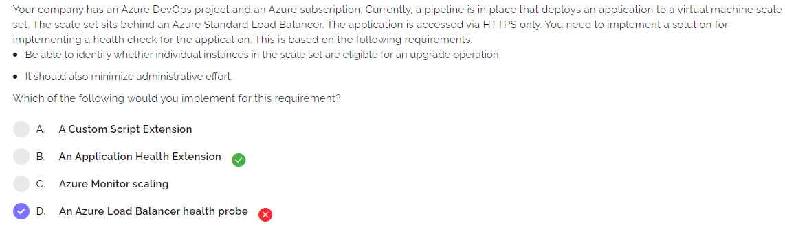
https://docs.microsoft.com/en-us/azure/virtual-machine-scale-sets/virtual-machine-scale-sets-health-extension
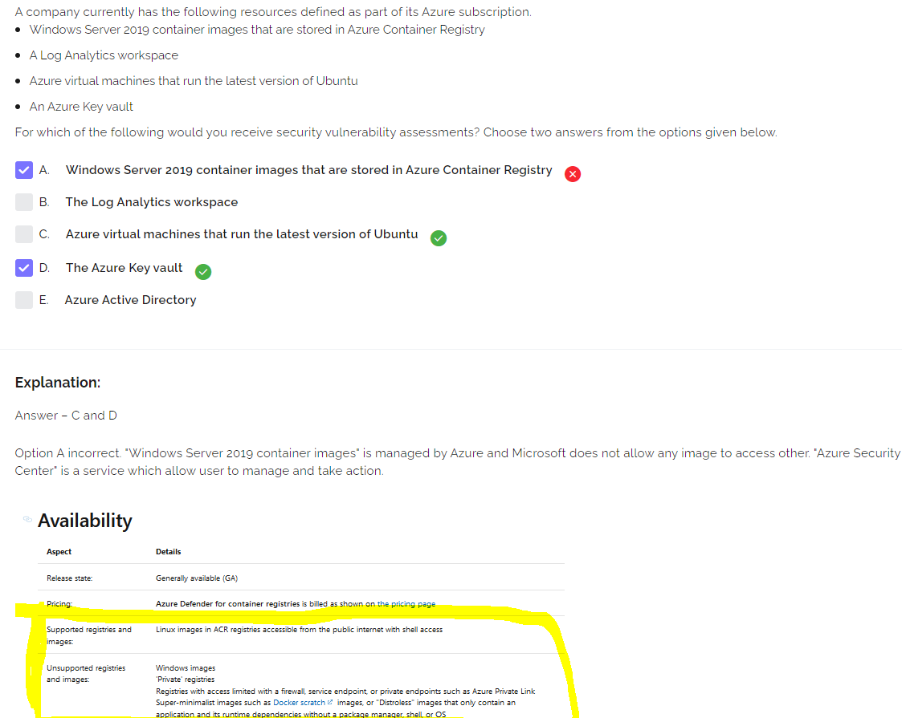
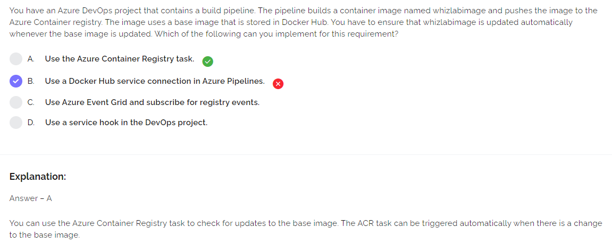
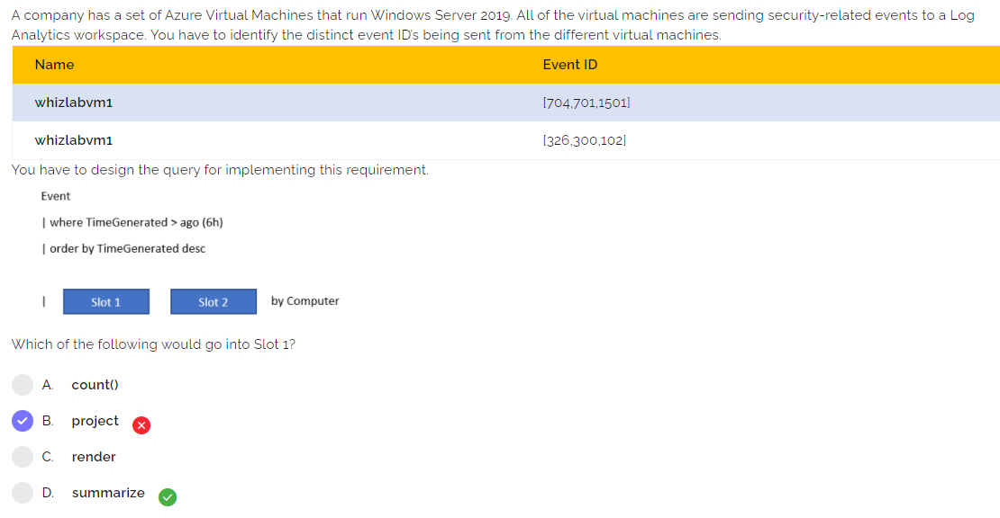
https://docs.microsoft.com/en-us/azure/azure-monitor/logs/get-started-queries
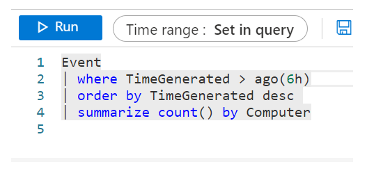
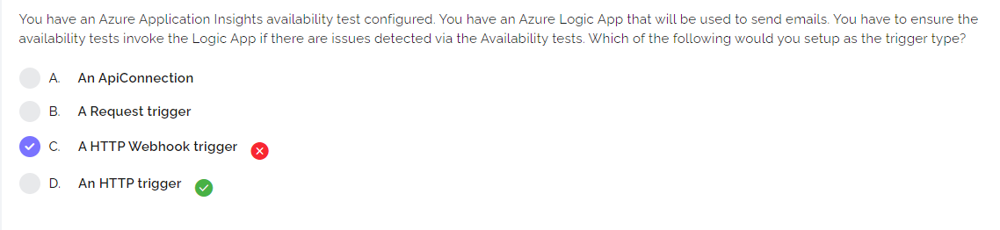
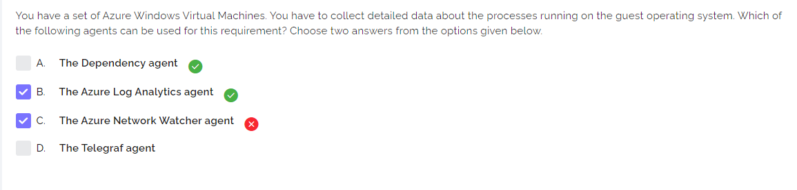
https://docs.microsoft.com/en-us/azure/azure-monitor/agents/agents-overview
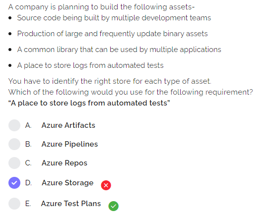
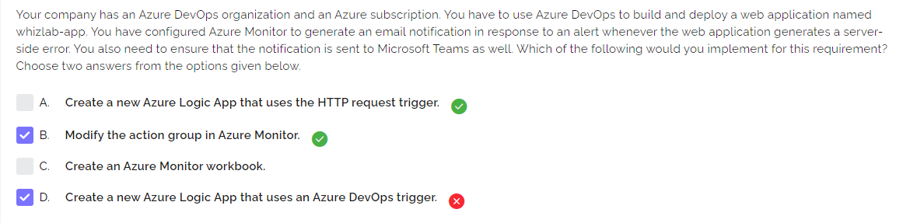
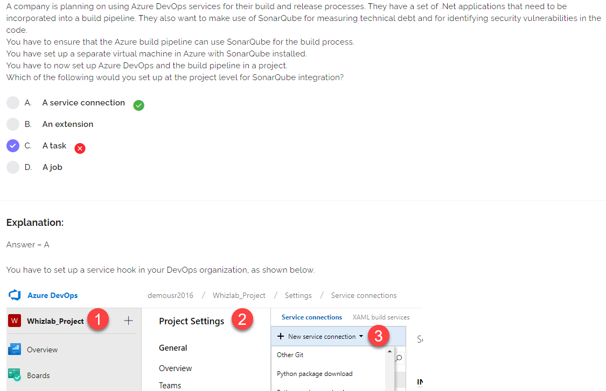
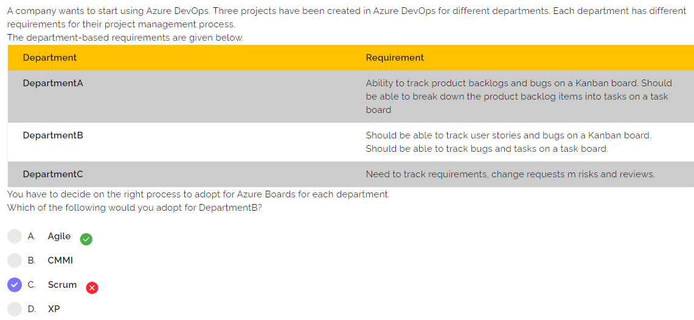
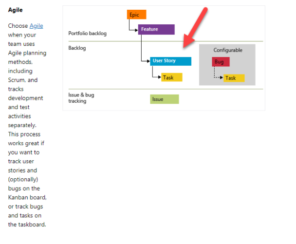
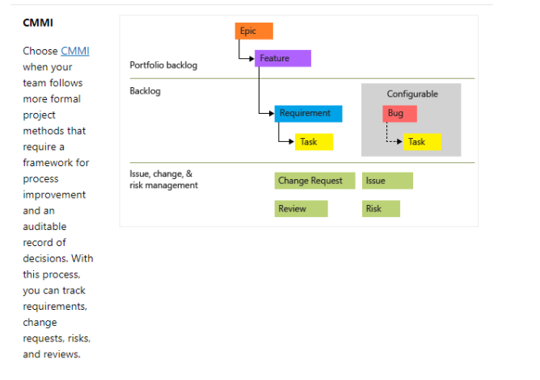
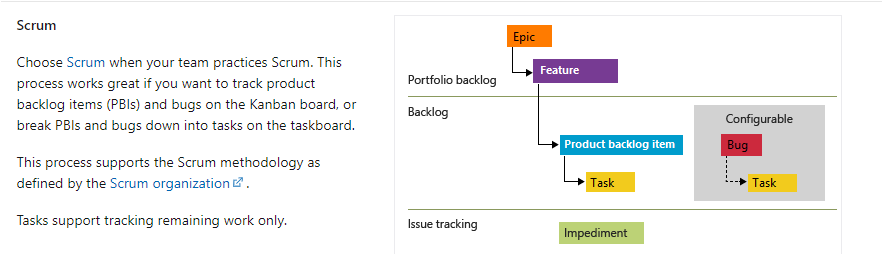
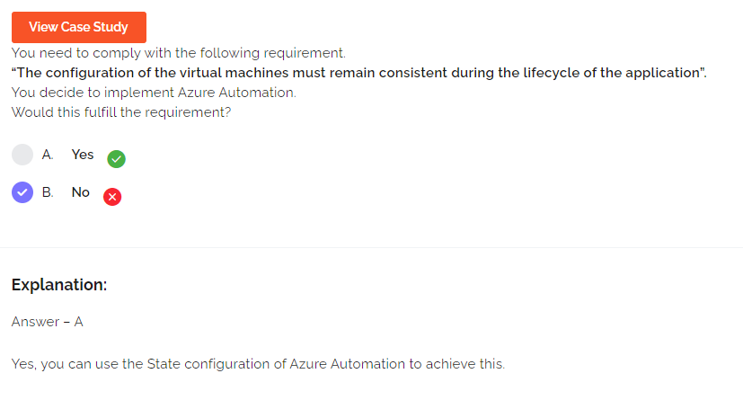
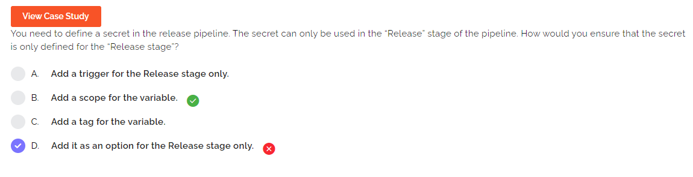
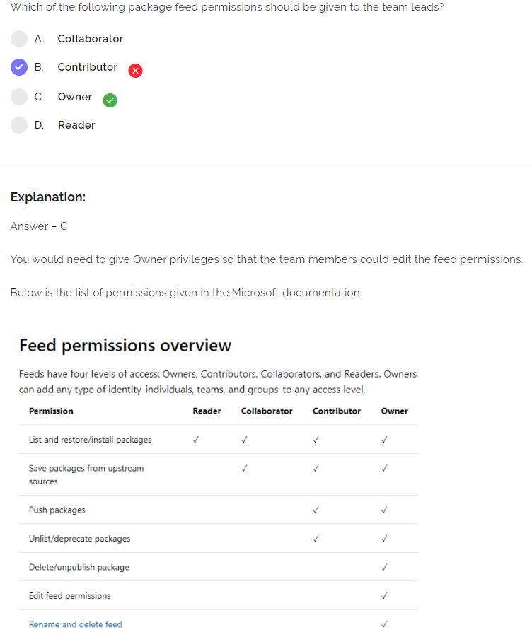
