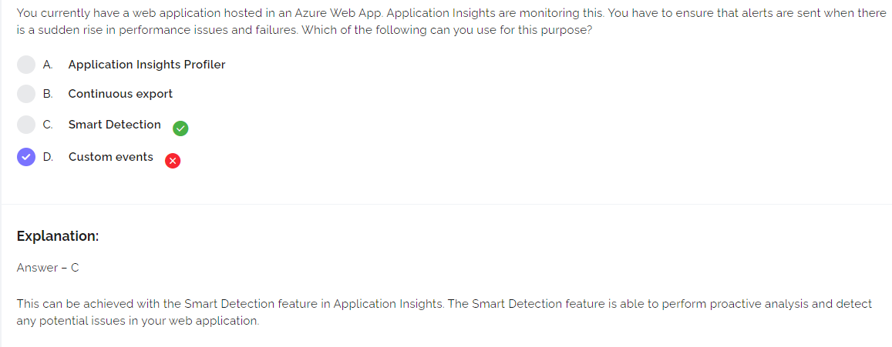

https://docs.microsoft.com/en-us/azure/virtual-machine-scale-sets/virtual-machine-scale-sets-health-extension

https://docs.microsoft.com/en-us/azure/azure-monitor/logs/get-started-queries

https://docs.microsoft.com/en-us/azure/azure-monitor/agents/agents-overview

