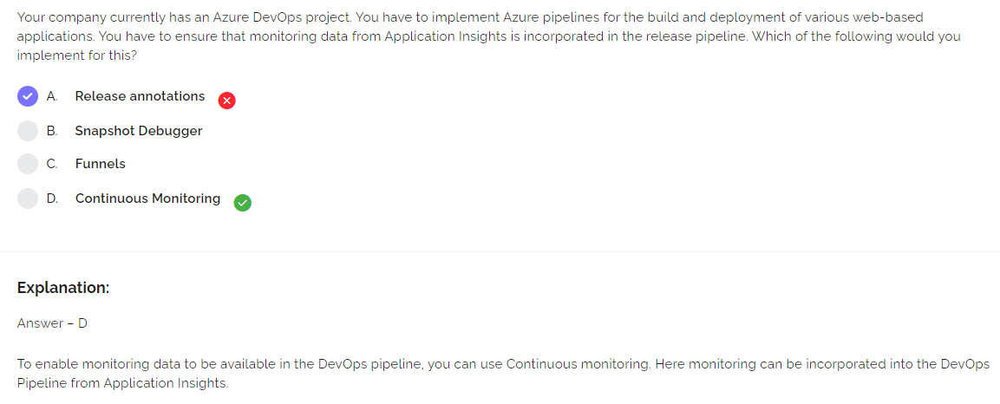
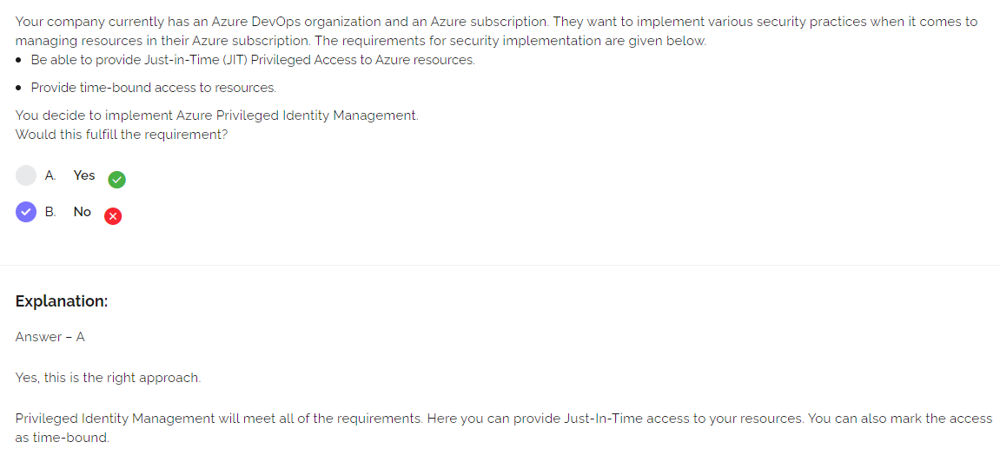
https://docs.microsoft.com/en-us/azure/active-directory/privileged-identity-management/pim-configure
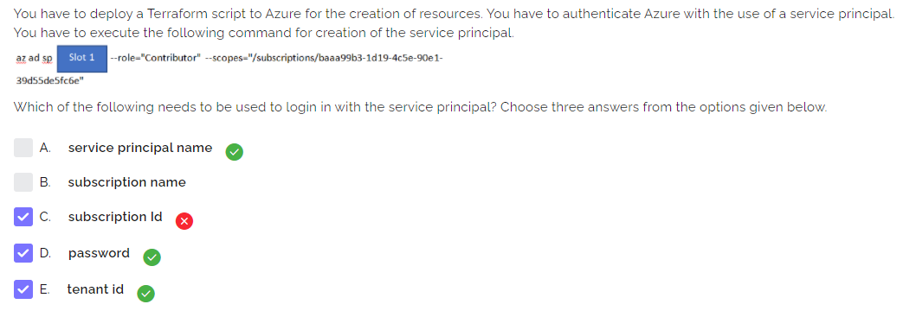
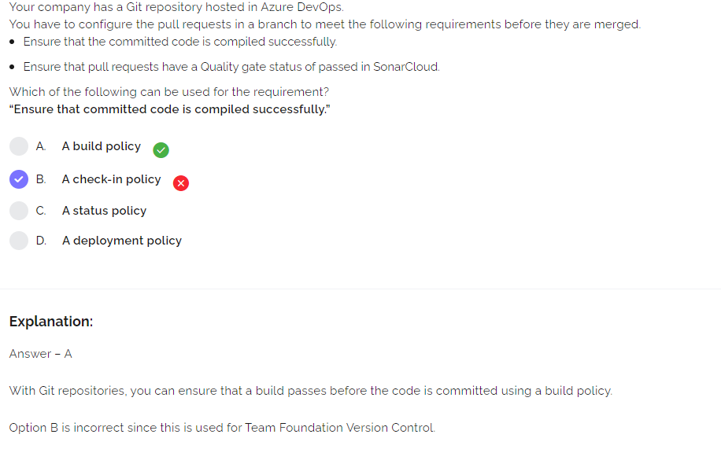
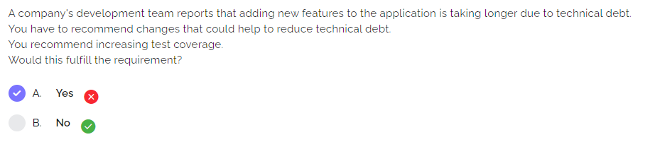
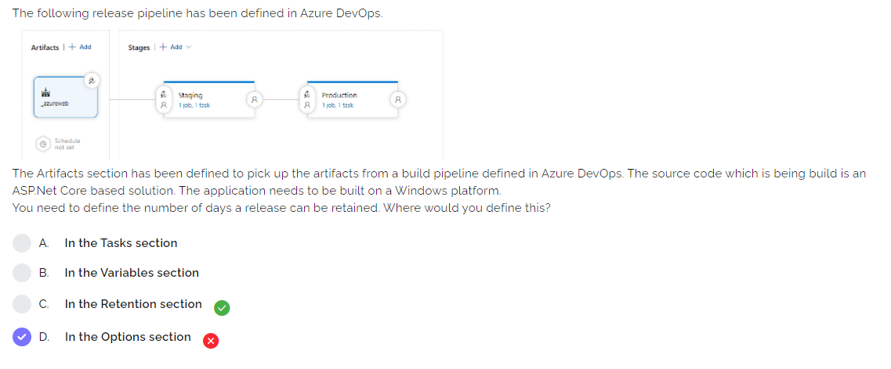
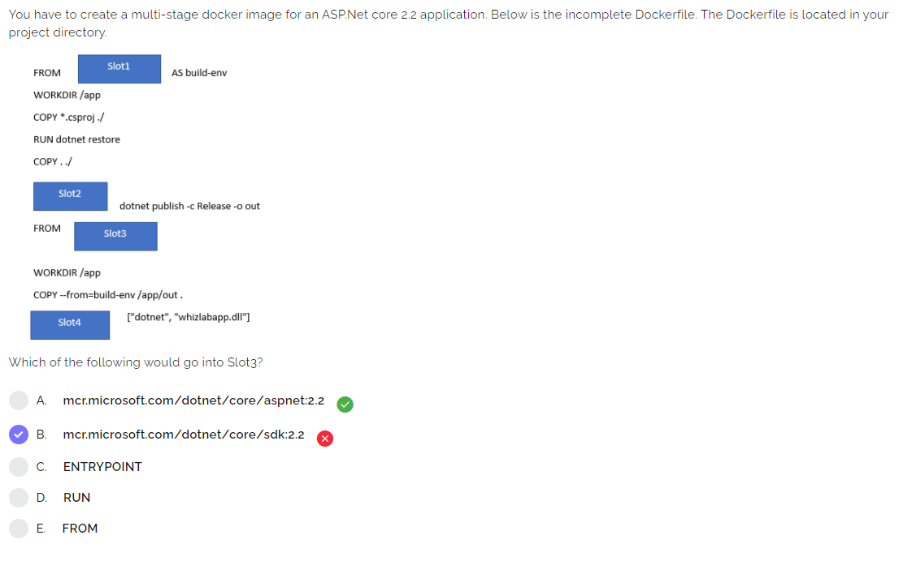
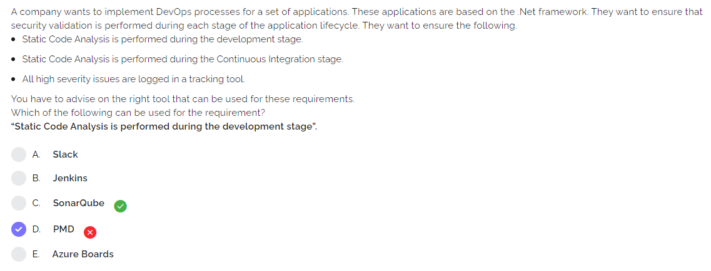
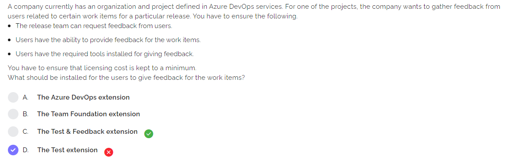
Q45,46,47...
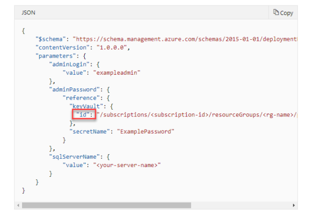
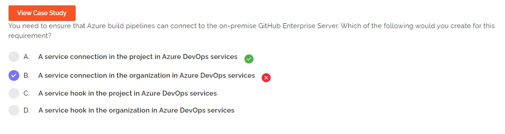
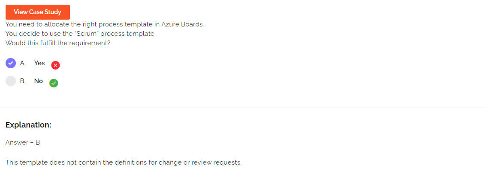
- **Scrum**: tasks created from `product backlog item`
- **Agile**: tasks created from `user stories`
- **CMMI**: tasks created from `requirements`, includes `change requests`

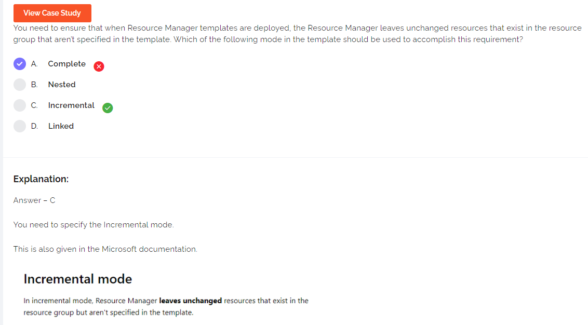
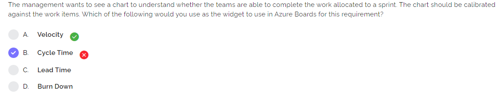

